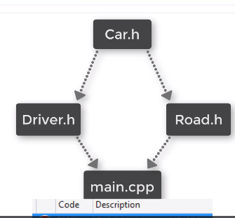

Class

- blueprint/template/recipe
- 추상화를 대변함

C++에서 클래스 선언은 헤더파일에서 하는 듯 하다.


이 관계를 기억해둘 것.
헤더파일을 두 번 포함시키지 아니한다.



이 관계는 Rehabilitation Error를 발생시킨다고 한다. 따라서 아래처럼 해야된다:


그래서 클래스를 어떻게 인스턴스화 시킬 것인가?
Constructor and Destructor

main.cpp

```c++
#include <iostream>
#include "Car.h"

int main()
{
	Car car = Car();
	car.FillFuel(6);
	car.Accelerate();
	car.Accelerate();
	car.Accelerate();
	car.Accelerate();
	car.Accelerate();
	car.Dashboard();
	return 0;
}

```

```c++
#pragma once
class Car {
private:
	float fuel;
	float speed;
	int passengers;
public:
	Car();
	~Car();
	void FillFuel(float amount);
	void Accelerate();
	void Break();
	void AddPassengers(int count);
	void Dashboard();
};
```

```c++
#include "Car.h"
#include <iostream>


Car::Car()
{
	fuel = 0;
	speed = 0;
	passengers = 0;
}

Car::~Car()
{
	std::cout << "~Car()" << std::endl;
}

void Car::FillFuel(float amount)
{
	fuel = amount;
}

void Car::Accelerate()
{
	speed++;
	fuel -= 0.5f;
}


void Car::Break()
{
	speed = 0;
}

void Car::AddPassengers(int count)
{
	passengers = count;
}

void Car::Dashboard()
{
	std::cout << "Fuel : " << fuel << std::endl;
	std::cout << "Speed : " << speed << std::endl;
	std::cout << "Passengers : " << passengers << std::endl;
}
```

이게 헤더파일이 사용된 예시같다.

Non Static Member Initialization
이란 개념도 있다. 클래스 정의에서 그냥 초기화값을 넣어주면, 그리고 Default 생성자가 빈칸이라면 작동한다.